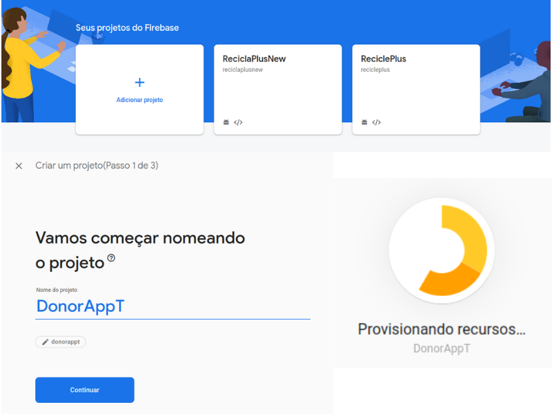

# Coletor (Aplicativo do coletor)

A parceria entre a Universidade de São Paulo (USP) e o Centro Federal de Educação Tecnológica de Minas Gerais (CEFET-MG) resultou na criação de um software inovador voltado para a doação de lixo reciclável às organizações. Essa colaboração entre duas instituições de renome visa promover a conscientização ambiental e contribuir para a sustentabilidade.

O software desenvolvido permite que usuários e empresas realizem doações de lixo reciclável para organizações e cooperativas de reciclagem. Essa iniciativa tem como objetivo principal incentivar a redução de resíduos e o reaproveitamento de materiais, além de fomentar a economia circular.

Por meio dessa parceria estratégica, a USP e o CEFET-MG uniram seus conhecimentos e experiências para criar um sistema seguro, eficiente e de fácil utilização. O software oferece recursos como cadastro de doadores e receptores, rastreamento de doações, estatísticas de impacto ambiental e interação entre os usuários.

Essa iniciativa conjunta entre as duas instituições de ensino busca não apenas desenvolver uma solução tecnológica, mas também promover a conscientização sobre a importância da reciclagem e do correto descarte de resíduos. A parceria entre a USP e o CEFET-MG demonstra o compromisso dessas instituições com a inovação, o desenvolvimento sustentável e a responsabilidade socioambiental.

Com esse software de doação de lixo reciclável, espera-se fortalecer as ações de reciclagem, engajando a comunidade e as empresas na causa ambiental. Ao unir esforços e conhecimentos, a parceria USP-CEFET-MG busca criar soluções que contribuam para um futuro mais sustentável, onde a reciclagem e o reaproveitamento de materiais sejam práticas comuns e essenciais para a preservação do meio ambiente. 

## Primeiros passos


Para configurar o ambiente, é necessário fazer o download do projeto. Você pode optar por baixar o zip do projeto de forma direta, como mostrado na marcação 2 da imagem acima, ou clonar o repositório utilizando o seguinte comando, com a URL destacada na marcação 1 da imagem acima:

```sh
git clone https://github.com/leonardo8787/Coletor.git
```

## Executando o projeto
Para executar o projeto, é importante garantir que todos os pacotes necessários estejam disponíveis em sua máquina. A seguir, apresentamos um passo a passo para configurar o ambiente e executar o projeto, dividido em duas seções: uma para aqueles que não possuem o React Native instalado e outra para aqueles que já têm o ambiente configurado. É importante ressaltar que, caso você ainda não tenha o React Native instalado, será necessário concluir ambas as etapas a seguir (Tal processo deve ser realizado no sistema operacional Linux): 

#### Não tenho o React Native (Expo) instalado
O processo de instalação do React Native no Linux envolve alguns passos. Aqui está um guia básico para ajudar você a configurar o ambiente de desenvolvimento (no terminal, digite os seguintes comandos):

1. Instale o Node.js
   ```sh
    sudo apt-get update
    sudo apt-get install -y nodejs
   ```
   Verifique se a instalação foi concluída com sucesso executando node -v e npm -v no terminal.

2. Instale o JDK (Java Development Kit)
   ```sh
    sudo apt-get install -y openjdk-8-jdk
   ```
   Verifique se a instalação foi concluída com sucesso executando java -version no terminal.

3. Instale o React Native CLI e outras dependências
   ```sh
    sudo npm install -g react-native-cli
   ```

4. Instale o Expo CLI globalmente
   ```sh
    sudo npm install -g expo-cli
   ```
   
5. Instale o Yarn (opcional, mas recomendado) com o seguinte comando
    ```sh
    sudo npm install -g yarn
   ```

#### Já tenho o React Native instaldo
Com o projeto baixado, você deve entrar na pasta raiz do projeto e abrir um terminal para instalar os pacotes necessários, permitindo realizar a execução do mesmo. Para isso, execute o seguinte comando:

6. Instalando dependências do projeto
    ```sh
    npm install 
    ```
7. Executando o projeto pelo pacote npm
     ```sh
    npm start 
    ```
8. Executando o projeto pelo pacote expo
     ```sh
    npx expo start 
    ```

## Adicionando seu Próprio Banco de Dados Firebase
Para começar a utilizar o projeto de maneira personalizada e individual, é necessário criar um banco de dados Firebase e conectá-lo ao aplicativo específico. É importante ressaltar que os dados inseridos no aplicativo são apenas exemplos e nenhuma operação real está sendo realizada no banco de dados.
1. Crie uma conta ou faça login no Firebase 
    *  Acesse o site do Firebase (https://firebase.google.com) e faça login ou crie uma nova conta.
  
2. Crie um novo projeto no Firebase
    * No console do Firebase, crie um novo projeto clicando no botão "Adicionar projeto" e siga as instruções fornecidas.
    

3. Gere uma aplicação Web dentro do fire base
    * O processo de geração de uma nova aplicação pode ser visualizado através do gif abaixo
    

4. Adicionando informações retornadas pelo firebase no projeto React-native
   1. Copie os dados selecionados no gif anterior
   2. Abra o arquivo src/constants/firebase.ts e substitua o 'firebaseConfig pelo que foi copiado anteriormente
   
5. Crie os bancos de dados utilizados. Na aba de criação que pode ser visualizada na imagem abaixo, gere:
   1. firestore Database
   2. Authentication
   3. storage
   
6. Feito isso, o projeto já pode ser executado normalmente e todas informações serão enviadas diretamente para esse banco de dados criado.


## Configuração de Layout

Todas as configurações de layout e estrutura do aplicativo estão disponíveis dentro da pasta src/constants. Esses arquivos fornecem opções para personalizar o layout, as cores, as fontes e outras configurações importantes do aplicativo. Aqui estão algumas das configurações disponíveis:

1. **advices.ts** : mensagens específicas e cores associadas à tela de avisos para fornecer informações importantes ao usuário. Essas mensagens e cores têm o objetivo de chamar a atenção do usuário para situações relevantes.
2. **erros.ts** : estão definidas mensagens de erro que podem ser exibidas ao usuário para fornecer informações claras sobre problemas ou situações inesperadas
3. **firebase.ts** : estão disponíveis as configurações do Firebase, juntamente com as informações de acesso ao banco de dados. Essas configurações e informações são cruciais para estabelecer a conexão entre o aplicativo e o Firebase.  
4. **scale.ts** : estão disponíveis informações sobre as fontes e a escala utilizadas para garantir uma experiência visual consistente e agradável aos usuários. Essas informações são importantes para a definição do estilo de texto e a legibilidade do conteúdo.
5. **setting.ts** : informações sobre as cores utilizadas e o tema disponível, permitindo a escolha entre os modos claro (light) e escuro (dark). Essas informações são essenciais para definir a aparência visual do aplicativo e proporcionar uma experiência personalizada aos usuários. 

Além desses arquivos, você também pode encontrar outras configurações importantes relacionadas a estrutura e organização do código do aplicativo. Certifique-se de explorar a pasta src/constants para ajustar as configurações conforme necessário e personalizar o aplicativo de acordo com suas preferências e requisitos.

# Autores

 - Gabriel Rosa
 - Leonardo Campos
